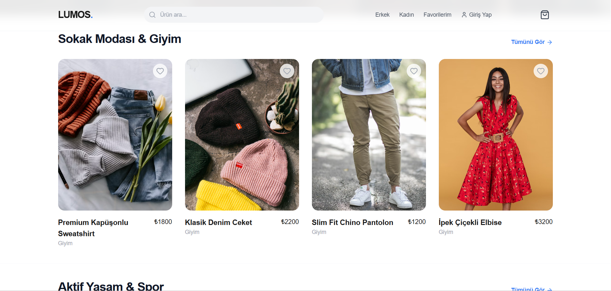
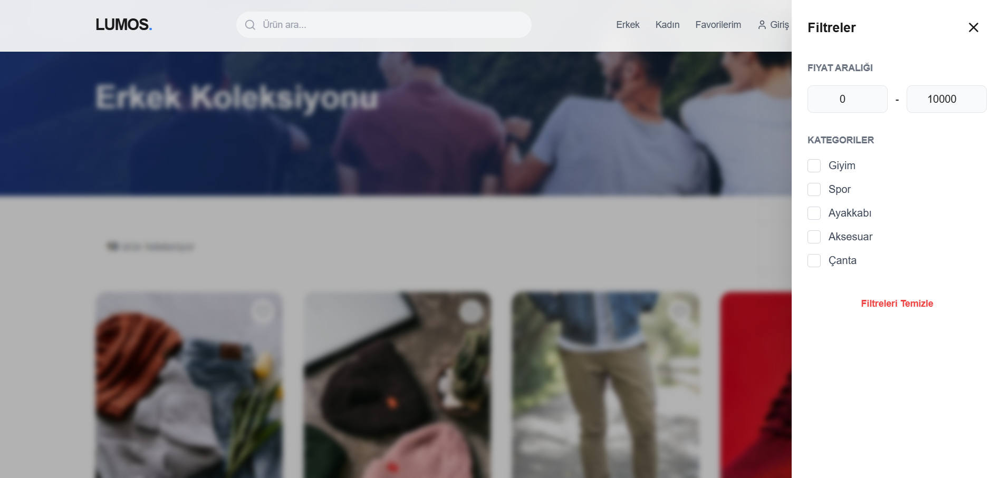
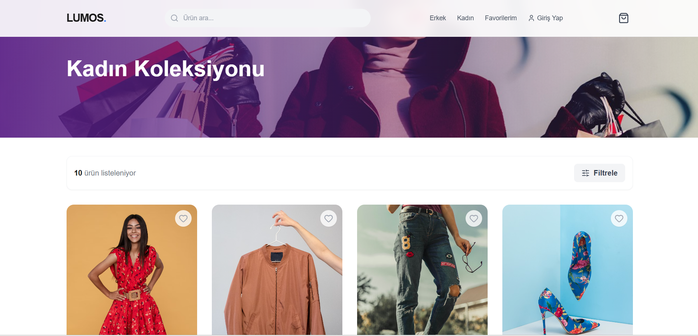
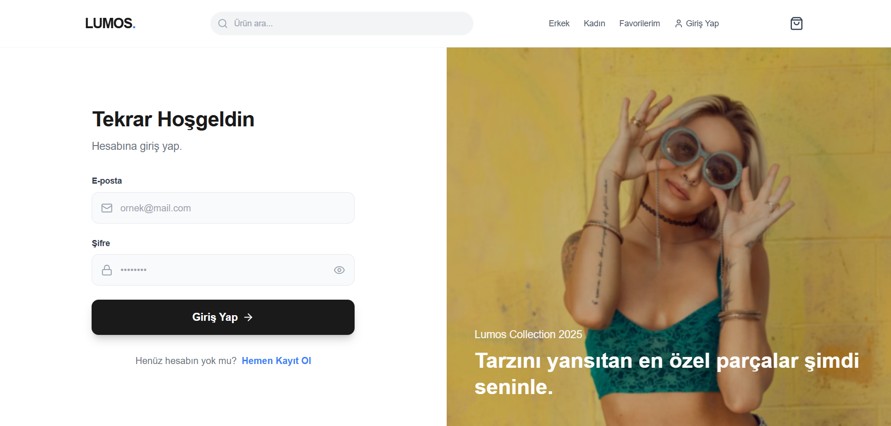
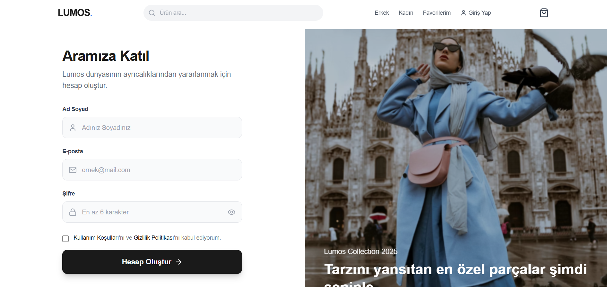
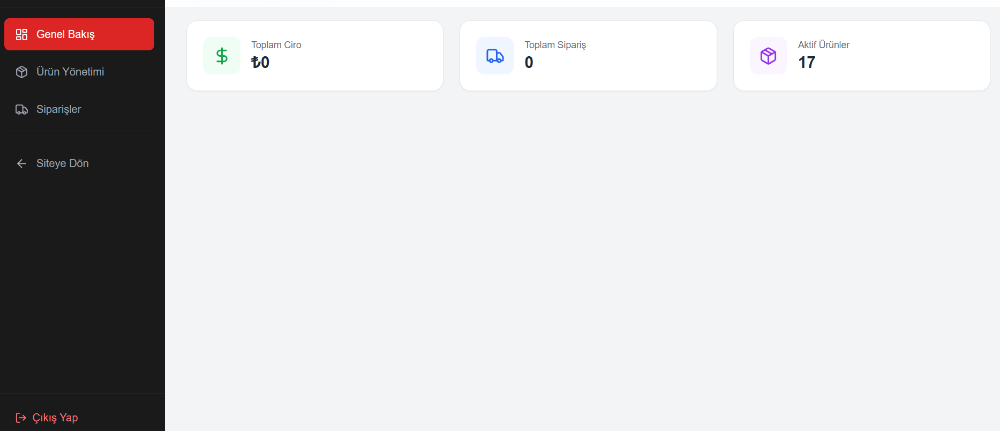
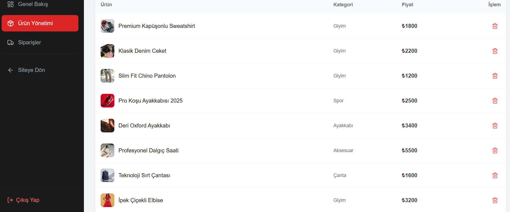
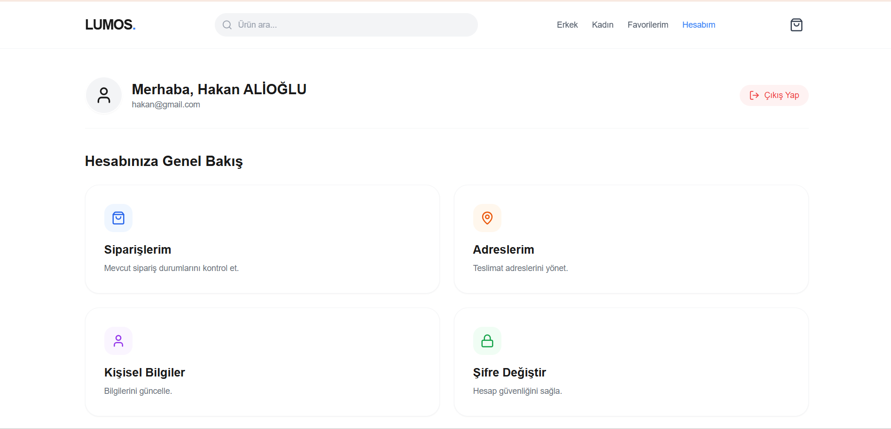

# Lumos E-Ticaret Platformu 🚀


**Lumos**, kesintisiz ve modern bir alışveriş deneyimi sunmak için tasarlanmış, uçtan uca (Full-Stack) bir e-ticaret uygulamasıdır. Güçlü ve ölçeklenebilir **ASP.NET Core Web API** backend'i ile **React** ve **Tailwind CSS** kullanılarak geliştirilmiş dinamik bir frontend mimarisine sahiptir.

Bu proje, ürün filtrelemeden sepet yönetimine, güvenli ödeme simülasyonundan kapsamlı bir yönetici (admin) paneline kadar eksiksiz bir e-ticaret akışını gösterir.

---

## 🛠 Kullanılan Teknolojiler (Tech Stack)

### **Frontend (İstemci Tarafı)**
* **Framework:** React.js (Vite altyapısı ile hızlı derleme)
* **Stil & Tasarım:** Tailwind CSS
* **State Yönetimi:** React Context API
* **Animasyonlar:** Framer Motion (Sayfa geçişleri ve mikro etkileşimler)
* **İkon Seti:** Lucide React
* **Yönlendirme:** React Router DOM

### **Backend (Sunucu Tarafı)**
* **Framework:** ASP.NET Core Web API (.NET 8/9)
* **Veritabanı:** SQL Server (LocalDB)
* **ORM:** Entity Framework Core (Code-First Yaklaşımı)
* **Kimlik Doğrulama:** JWT (JSON Web Tokens) & BCrypt (Şifreleme)
* **Dokümantasyon:** Swagger UI

---

## ✨ Öne Çıkan Özellikler

### 🛍️ **Alışveriş ve Müşteri Deneyimi**
* **Modern UI/UX:** Hero bannerlar, kategori sliderları ve yumuşak geçişlerle responsive (mobil uyumlu) tasarım.
* **Gelişmiş Filtreleme & Arama:**
    * Kategori, fiyat aralığı ve cinsiyete göre filtreleme.
    * Performans için "Debounce" (gecikmeli) mekanizması ile çalışan akıllı arama çubuğu.
* **Dinamik Sepet Yönetimi:** Gerçek zamanlı ürün ekleme, çıkarma ve adet güncelleme.
* **Güvenli Ödeme (Checkout):** Kredi kartı (Luhn algoritması kontrolü vb.) ve adres bilgileri için validasyonlu form yapısı.
* **Kullanıcı Hesabı:**
    * **Adres Defteri:** Veritabanına kayıtlı adres ekleme/silme işlemleri.
    * **Sipariş Takibi:** Geçmiş siparişlerin durumu ve detayları.
    * **Profil Yönetimi:** Şifre ve kullanıcı bilgisi güncelleme.

### 🔐 **Güvenlik ve Kimlik Doğrulama**
* JWT tabanlı güvenli Giriş ve Kayıt sistemi.
* Rol tabanlı yetkilendirme (Admin ve Müşteri ayrımı).
* BCrypt ile güvenli şifre hashleme.
* Frontend tarafında korumalı rotalar (Protected Routes).

### ⚡ **Yönetici (Admin) Paneli**
* **Genel Bakış:** Toplam satış, sipariş sayısı ve ürün metrikleri.
* **Ürün Yönetimi:** Veritabanına yeni ürün ekleme ve silme.
* **Sipariş Yönetimi:** Gelen siparişleri görüntüleme ve statülerini güncelleme (Hazırlanıyor, Kargolandı, Teslim Edildi vb.).

---

## 📸 Ekran Görüntüleri

Projenin arayüzünden bazı kareler:

### 🏠 Anasayfa ve Kategoriler
| Modern Anasayfa Tasarımı | Kategori ve Filtreleme |
|--------------------------|------------------------|
|  |  |
| **Kadın Koleksiyonu** | **Detaylı Ürün Gösterimi** |
|  | *(Arayüzden detay görseli)* |

### 🔐 Kimlik Doğrulama
| Giriş Yap (Login) | Kayıt Ol (Register) |
|-------------------|---------------------|
|  |  |

### ⚡ Yönetim ve Kullanıcı Paneli
| Admin Dashboard (Özet) | Admin Sipariş Yönetimi |
|------------------------|------------------------|
|  |  |

| Kullanıcı Hesabı & Adresler |
|-----------------------------|
|  |

---

## 🚀 Kurulum ve Başlangıç

Projeyi kendi bilgisayarınızda çalıştırmak için aşağıdaki adımları izleyin.

### Gereksinimler
* [Node.js](https://nodejs.org/) (v16 veya üzeri)
* [.NET SDK](https://dotnet.microsoft.com/download) (v8.0 veya v9.0)
* SQL Server (veya Visual Studio ile gelen LocalDB)

### 1. Backend Kurulumu (`Lumos.API`)

1.  Terminali açın ve backend klasörüne gidin:
    ```bash
    cd Lumos.API
    ```
2.  Gerekli paketleri yükleyin:
    ```bash
    dotnet restore
    ```
3.  Uygulamayı başlatın (Veritabanı otomatik oluşturulacak ve örnek veriler yüklenecektir):
    ```bash
    dotnet run
    ```
    *API varsayılan olarak `https://localhost:7211` adresinde çalışacaktır.*

### 2. Frontend Kurulumu (`shop-modern`)

1.  Yeni bir terminal açın ve frontend klasörüne gidin:
    ```bash
    cd shop-modern
    ```
2.  Bağımlılıkları yükleyin:
    ```bash
    npm install
    ```
3.  Geliştirme sunucusunu başlatın:
    ```bash
    npm run dev
    ```
4.  Tarayıcınızda `http://localhost:5173` adresine gidin.

---

## 📂 Proje Yapısı

```text
Lumos-Ecommerce/
├── Lumos.API/              # Backend (ASP.NET Core)
│   ├── Controllers/        # API Uç Noktaları (Auth, Products, Orders vb.)
│   ├── Data/               # Veritabanı Bağlantısı & Seed Data (EF Core)
│   ├── Models/             # Veritabanı Tablo Modelleri
│   ├── DTOs/               # Veri Transfer Objeleri
│   └── Program.cs          # Konfigürasyon & Middleware Ayarları
│
└── shop-modern/            # Frontend (React + Vite)
    ├── src/
    │   ├── components/     # Tekrar kullanılabilir bileşenler (Navbar, Footer, Kartlar)
    │   ├── context/        # Global State Yönetimi (ShopContext)
    │   ├── pages/          # Sayfalar (Anasayfa, Sepet, Admin, Hesap)
    │   └── layouts/        # Sayfa Düzenleri (Auth & Dashboard Layouts)
    └── tailwind.config.js  # Tasarım Konfigürasyonu
